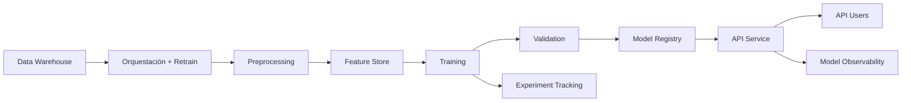

# 🚀 Trabajo Integrador — IA en Producción

Plataforma para pronóstico de producción de hidrocarburos utilizando Machine Learning en un entorno productivo.

---

## 📌 Overview

Este proyecto tiene como objetivo desarrollar un **pipeline de ML listo para producción** que permita:

- Predecir la producción futura de hidrocarburos
- Reducir la incertidumbre operativa
- Exponer resultados vía API REST
- Garantizar trazabilidad y reproducibilidad de modelos

> ⚠️ **Nota:** El foco está en **ML Engineering**, no en la precisión del modelo.

---

## 🧠 Problem Statement

Actualmente, los equipos enfrentan:

- Alta incertidumbre en planificación
- Procesos manuales y dispersos
- Baja trazabilidad de decisiones
- Dependencia del conocimiento individual

---

## 🎯 Objectives

- 📈 **Forecasting:** Predicción a corto, medio y largo plazo  
- 🔍 **Reducir incertidumbre operativa**  
- 🔗 **Integración vía API REST**  
- 🧾 **Trazabilidad de modelos y datos**

---

## 🏗️ Architecture



---

## 👥 Users

### 🔌 API Consumers
- Consumen predicciones vía REST

### 🧪 ML Engineers
- Acceden a experiment tracking
- Gestionan entrenamiento y despliegue

---

## 📊 Datasets

- Producción de pozos  
- Listado de pozos  

---

## 🔌 API Specification

### Base URL
```
/api/v1
```

### 📍 `GET /forecast`

Obtiene el pronóstico de producción.

#### Query Params
| Param        | Type   | Required | Description              |
|--------------|--------|----------|--------------------------|
| id_well      | string | ✅       | ID del pozo              |
| date_start   | date   | ✅       | Fecha inicio             |
| date_end     | date   | ✅       | Fecha fin                |

#### Response
```json
{
  "id_well": "POZO-001",
  "data": [
    {
      "date": "2023-10-01",
      "prod": 150.5
    }
  ]
}
```

---

### 📍 `GET /wells`

Listado de pozos disponibles.

#### Query Params
| Param       | Type | Required | Description |
|-------------|------|----------|------------|
| date_query  | date | ✅       | Fecha de consulta |

#### Response
```json
[
  {
    "id_well": "POZO-001"
  }
]
```

---

## ⚙️ Tech Requirements

- Docker & Docker Compose
- API REST
- Feature Store
- Model Registry
- Experiment Tracking
- Orquestación

---

## 🚀 Getting Started

### 1. Clonar repo
```bash
git clone <repo-url>
cd <repo>
```

### 2. Levantar entorno
```bash
docker-compose up --build
```

### 3. Acceder a servicios

- API → http://localhost:8000
- Docs → http://localhost:8000/docs

---

## 🔁 ML Pipeline

- Ingesta de datos
- Feature engineering → Feature Store
- Training reproducible
- Logging de métricas y artefactos
- Registro de modelos
- Serving vía API

---

## 📦 Deliverables

### 📅 Entrega Parcial

- [x] Sistema dockerizado
- [x] API funcional conforme OpenAPI
- [x] Experiment tracking (MLflow + alias `production`)
- [x] Logging de métricas y artefactos
- [x] Feature Store persistente (DAG `ml_pipeline` puebla `featurestore.features`)
- [x] Training reproducible (`airflow dags trigger ml_pipeline` con params `date_from`/`date_to`)

---

### 📅 Entrega Final

- [x] Orquestación automática (DAG `ml_pipeline` con schedule `0 2 1 * *`)
- [x] Retraining periódico (mensual + auto-trigger desde `drift_report` ante drift/decay)
- [x] Model decay (RMSE-degradation contra baseline taggeado en MLflow)
- [x] Data drift / concept drift (PSI + KS test, reporte semanal en MLflow `drift_monitoring`)
- [x] Infraestructura escalable (Ray Serve, 2 réplicas, FastAPI proxy)

Ver [docs/checklist_implementacion.md](docs/checklist_implementacion.md) para los punteros a archivos y líneas que respaldan cada ítem.

---

## 👥 Equipo y contribuciones

Trabajo desarrollado por:

- **Hernan** ([hernangm](https://github.com/hernangm)) — pipeline Airflow (`ml_pipeline`, `drift_report`), feature store en PostgreSQL, integración MLflow + alias `production`, deploy de Ray Serve.
- **Matias** ([matiascaccia](https://github.com/matiascaccia)) — docker-compose & redes entre servicios, API FastAPI (`/wells`, `/forecast`, `/health`), repositorios SQLAlchemy y suite de tests.

La historia de commits y PRs refleja el reparto de tareas entre ambos integrantes.

## 🤝 Collaboration Guidelines

- Uso obligatorio de Pull Requests
- Commits claros y distribuidos
- Trabajo equitativo entre miembros
